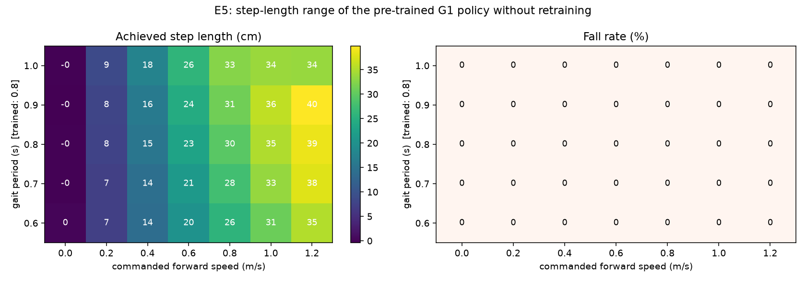
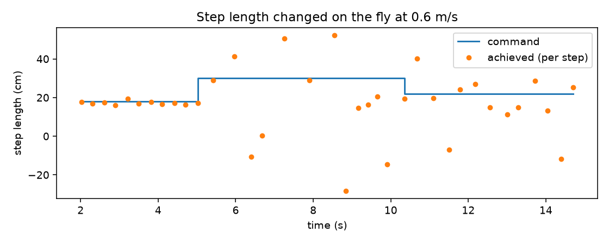
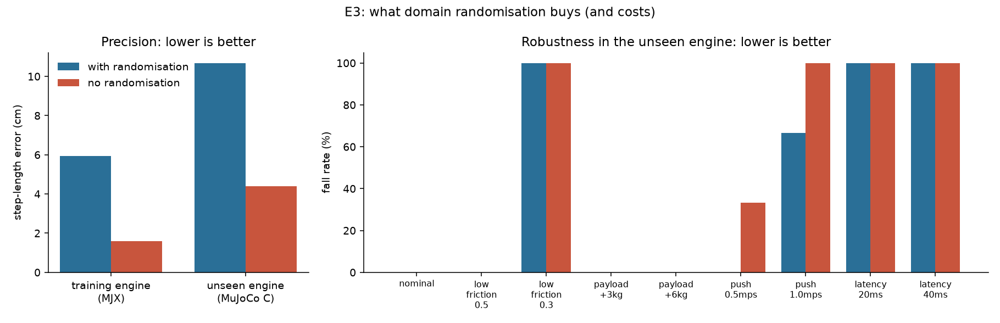

# Learning pipeline: G1 step-length adjustment

Living document: update the result sections as experiments finish.

## 1. Task specification

| Item | Value |
|---|---|
| Robot | Unitree G1 (29-DoF Playground model for training; 12-DoF Unitree model for vendor baseline) |
| Command | forward speed `v` ∈ [0.3, 0.9] m/s, step length `ℓ` ∈ [0.15, 0.35] m |
| Derived | cadence `f = v / 2ℓ`, limited to 0.9–1.8 Hz (gait period 0.56–1.11 s) |
| Success (provisional) | step-length error < 3 cm, speed error < 0.1 m/s, 0 falls in 100 nominal episodes, survives 0.5 m/s pushes |

## 2. E5 — do we need learning at all? (vendor policy, no retraining)

Unitree's pre-trained G1 policy (LSTM, trained in Isaac Gym, run here in MuJoCo) takes a speed
command and an internal gait clock (trained at 0.8 s). Swept 7 speeds × 5 gait periods × 3 seeds
with light pushes and sensor noise (105 runs, 15 s on a laptop CPU):

| gait period (s) | 0.2 m/s | 0.4 | 0.6 | 0.8 | 1.0 | 1.2 |
|---|---|---|---|---|---|---|
| 0.6 | 7.2 cm | 14.1 | 20.1 | 25.8 | 30.8 | 35.2 |
| 0.7 | 7.2 | 14.2 | 21.2 | 27.6 | 33.4 | 37.9 |
| **0.8 (trained)** | 7.7 | 15.4 | 22.9 | 29.5 | 35.0 | 38.6 |
| 0.9 | 8.0 | 16.3 | 24.3 | 31.1 | 36.0 | 39.9 |
| 1.0 | 8.6 | 17.6 | 26.0 | 32.6 | 33.8 | 33.6 |

Findings:
* **No falls in any of the 105 runs.** Step length from about 7 cm to 40 cm is reachable without retraining.
* **Cadence follows the clock exactly** (for example period 0.6 s gives 3.3 steps/s), so step length
  is set by speed ÷ cadence.
* **But speed and step length are not independent.** Off the trained 0.8 s period, speed tracking
  degrades. At 0.4 m/s the achieved speed ranges from 0.48 (period 0.6) to 0.36 m/s (period 1.0). At 1.2 m/s
  with period 1.0 the gait breaks down (step variability 16 cm, speed 0.99 m/s instead of 1.2).
* **Conclusion:** a coarse step-length change is possible by re-parameterising an existing policy
  (zero training cost). *Precise, independent* step length at a given speed needs the step length
  in the task definition. That is what the trained `StepLength` policy adds, and it's the comparison
  that shows SKF what extra training buys.

## 3. Training (v1)

| | |
|---|---|
| Hardware | Kaggle free tier, 1× NVIDIA T4 |
| Algorithm | Brax PPO, Playground's tuned G1 recipe, 8192 parallel envs, randomisation on |
| Budget | 202M env steps in **95 min** (~36k steps/s) |
| Reward | −6.0 → +15.8; mean episode length 46 → 815 of 1000 steps |

## 4. Results (v1)

### 4a. In the training engine (MJX): did it learn the task?
`scripts/eval_mjx.py`: fixed command, no noise, 9 s per run.

| speed | 15 cm requested | 25 cm | 35 cm |
|---|---|---|---|
| 0.5 m/s | 11.9 cm (err 3.1) | 18.6 (err 6.8, erratic) | 20.1 (cap 27.8, erratic) |
| 0.7 m/s | 18.0 (cmd capped 19.4, err 2.3) | **23.3 (err 1.9)** | 10.5 (gait breaks down) |
| 0.9 m/s | 23.8 (cmd capped 25.0, err 1.6) | **23.8 (err 1.6)** | **31.8 (err 3.2)** |

No falls; speed error 0.03 m/s. **At step rates of 1.2 Hz and above the task is learned: 1.6–3.2 cm error.**
At slow step rates (≤ 1.0 Hz: long steps at low speed) the gait turns irregular. We widened Playground's
1.25–1.5 Hz training range down to 0.9 Hz, and 200M steps did not cover the slow end.
"cmd capped" means the requested step length would need a step rate outside 0.9–1.8 Hz, so the nearest
achievable value was commanded instead.

### 4b. In a different engine (MuJoCo C, CPU): does it transfer?
`scripts/eval_suite.py`, same model file and solver settings, different physics implementation.

* **Walks, no falls** anywhere on the 4×5 command grid, but step-length error grows to **~10 cm** and
  speed error to 0.11 m/s.
* **Heading drift:** without steering, the robot turns 50–130° over 10 s (20–35° in MJX too). The policy
  tracks a yaw *rate*, so errors integrate. The evaluator therefore adds a classical heading-hold loop
  (P-controller → small yaw-rate command), which is how such policies are deployed.
* **Diagnosis:** a lock-step comparison from an identical start state gives identical observations at
  step 0 (so the evaluator is correct), with joint velocities diverging by about 3 rad/s after one
  control step. Raising solver iterations 3 → 50 does not close the gap. The policy is sensitive to how
  the two engines resolve foot contact, which is the sim-to-sim gap in miniature.
* **Stress tests (C engine, 0.6 m/s, 25 cm):** survives friction ×0.5, +3 kg and +6 kg payload,
  0.5 m/s pushes. Fails at friction ×0.3, 1.0 m/s pushes (2 of 3), and 40 ms actuation delay.
  The 20 ms delay result flips between runs, so treat it as marginal.

The demo (C engine) shows both regimes. At 18 cm (1.67 Hz) tracking is within about ±1 cm; switched to
30 cm at 0.6 m/s (1.0 Hz) the gait breaks up and does not fully recover at 22 cm.

## 4c. E3: what does domain randomisation buy?

Same task, same budget (202M steps, 97 min on a T4), but trained **without** randomisation, pushes or sensor noise.

| metric | with randomisation (v1) | no randomisation |
|---|---|---|
| step error, training engine | 5.9 cm (slow step rates break down) | **1.6 cm** (every command) |
| step error, unseen engine | 10.7 cm | **4.4 cm** |
| falls: 0.5 m/s pushes | **0 %** | 33 % |
| falls: 1.0 m/s pushes | **67 %** | 100 % |
| falls: friction ×0.5, +3/+6 kg payload | 0 % | 0 % |
| falls: friction ×0.3, 20/40 ms delay | 100 % | 100 % |

* **Randomisation costs precision.** The no-randomisation policy tracks step length about 4× better in the training
  engine and about 2.5× better in the unseen engine. It also learned the slow step rates that v1 did not, so v1's
  slow-step failure comes from the harder, randomised training problem, not from the widened step-rate range.
* **Randomisation buys push recovery,** the one disturbance it explicitly trained on.
* **Neither policy handles** very low friction or actuation delay: neither was in the training distribution.
  Delay in particular will exist on the real robot, so v2 must randomise it.
* Caveat: one training seed per variant; stress cases use 3 evaluation seeds.

**Takeaway for an industrial pipeline:** randomisation is not free. Randomise what the deployment will actually
see (delay, pushes, floor friction ranges measured on site), and budget more training for it, or use a
curriculum that masters the task first and hardens it afterwards.

## 5. Why it works / why it doesn't

**Works:** at normal-to-fast step rates, one added reward term plus an observation was enough. The standard
recipe learned independent speed and step-length control in 95 GPU-minutes, with no demonstrations.

**Doesn't (yet):**
1. **Slow, long steps.** E3 shows the no-randomisation policy learns them, so the randomised problem is simply harder in the same budget.
   Fixes for v2: a curriculum from 1.25–1.5 Hz outward, or sample step rates non-uniformly, or train longer.
2. **Engine transfer.** The policy exploits engine-specific contact behaviour. Fixes: randomise contact
   parameters more widely, add actuation delay during training, or train in one engine and fine-tune/validate
   in the other. This is the same gap that will appear sim-to-real, only smaller.
3. **Heading.** Needs a classical outer loop, which makes the system a hybrid (learned gait + classical steering).

**Compared with E5 (vendor policy, no training):** the vendor policy reaches 7–40 cm by re-timing its gait
clock, but speed and step length are coupled. The v1 policy decouples them and tracks within 2–3 cm in its
comfortable range, at the cost of 95 GPU-minutes plus roughly a day of engineering, most of it setup and
evaluation rather than learning (see `effort_log.csv`).

## 6. Release gate before hardware (proposed)

1. Pass the success criteria in §1 in the unseen engine (MuJoCo C) with randomisation on.
2. No fall under: friction ≥ 0.5, payload ≤ 3 kg, pushes ≤ 0.5 m/s, 20 ms latency.
3. Joint torque and velocity within 90 % of limits over the whole evaluation suite.
4. Then: gantry (harness) tests on the real robot, then supervised floor trials, then shadow operation.
